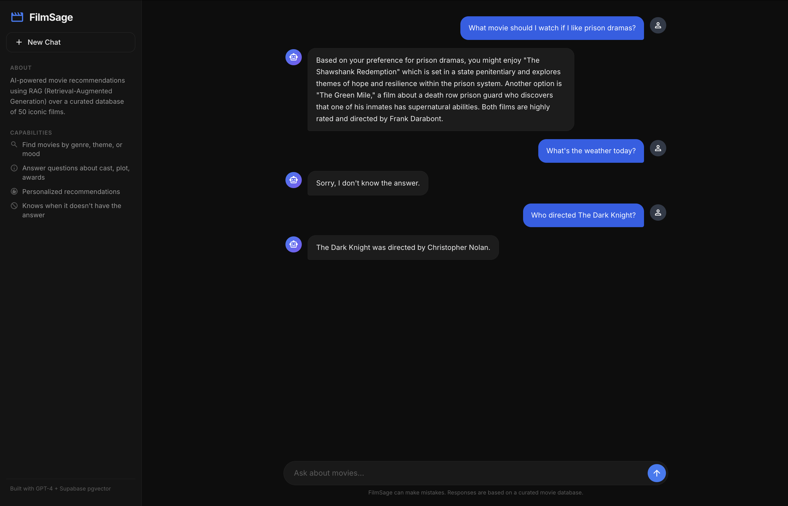

# FilmSage

An AI-powered movie recommendation chatbot built with RAG (Retrieval-Augmented Generation). It searches a vector database of 50 curated movie descriptions and gives grounded, conversational answers — no hallucinations.


## Demo



**Three capabilities in one conversation:**
- **Recommendations** — "What movie should I watch if I like prison dramas?" → Suggests The Shawshank Redemption and The Green Mile with reasoning
- **Off-topic refusal** — "What's the weather today?" → Politely declines instead of hallucinating
- **Factual recall** — "Who directed The Dark Knight?" → Christopher Nolan, pulled directly from the knowledge base

## Performance Metrics

Evaluated on 20 graded test queries (10 factual, 5 ambiguous, 5 adversarial):

| Metric | Value |
|---|---|
| Retrieval precision | **100%** (40/40 points) |
| Avg latency | **2,135ms** per query |
| Cost | **$17.21** per 1,000 queries |
| Corpus | **50 documents**, ~5,300 tokens |
| Embedding model | text-embedding-ada-002 (1536 dims) |
| Top-k | 4 chunks per query |
| Similarity threshold | 0.50 (cosine) |

> Full evaluation harness and graded results available in the [`eval/`](eval/) directory.

## How It Works

```
User question
    ↓
OpenAI text-embedding-ada-002 → 1536-dim query vector
    ↓
Supabase pgvector cosine search → top 4 matching movie descriptions
    ↓
GPT-4 generates answer grounded in retrieved context (temp=0.65)
    ↓
If no relevant match → "Sorry, I don't know the answer."
```

## Project Structure

```
├── index.html          # Frontend — chat UI with dark theme
├── index.js            # Frontend JS — chat messages, typing indicator, suggestions
├── index.css           # Dark theme styling
├── vite.config.js      # Vite config with dev proxy to backend
├── server/
│   └── index.js        # Express API — RAG pipeline (embed → retrieve → generate)
├── eval/
│   ├── seed-movies.js  # Seed Supabase with 50 movie descriptions + embeddings
│   ├── corpus-stats.js # Query corpus metrics (doc count, token sizes)
│   ├── eval-harness.js # Run 20 test queries, log retrieval + latency + cost
│   └── results.json    # Graded evaluation results
├── .env.example        # Required environment variables
├── Dockerfile          # Multi-stage production build
└── assets/
    └── demo.png        # Screenshot for README
```

## Running Locally

```bash
git clone https://github.com/YOUR_USERNAME/filmsage.git
cd filmsage

# Install dependencies
npm install
cd server && npm install && cd ..

# Set up environment variables
cp .env.example .env
# Fill in OPENAI_API_KEY, SUPABASE_URL, SUPABASE_API_KEY

# Seed the database (first time only)
node eval/seed-movies.js

# Run both frontend and backend
npm run dev
```

The client runs on `http://localhost:5173` and proxies API calls to the server on port 3001.

## Setup the Vector Database

FilmSage requires a Supabase project with pgvector. Run this in the Supabase SQL Editor:

```sql
-- Enable the extension
create extension if not exists vector;

-- Create the table
create table movies (
  id bigserial primary key,
  content text,
  embedding vector(1536)
);

-- Create the similarity search function
create or replace function match_movies(
  query_embedding vector(1536),
  match_threshold float,
  match_count int
)
returns table (id bigint, content text, similarity float)
language sql stable
as $$
  select id, content, 1 - (embedding <=> query_embedding) as similarity
  from movies
  where 1 - (embedding <=> query_embedding) > match_threshold
  order by similarity desc
  limit match_count;
$$;
```

Then run `node eval/seed-movies.js` to populate with 50 movie descriptions.

## Environment Variables

| Variable | Required | Description |
|---|---|---|
| `OPENAI_API_KEY` | Yes | OpenAI API key for embeddings + chat |
| `SUPABASE_URL` | Yes | Your Supabase project URL |
| `SUPABASE_API_KEY` | Yes | Supabase anon/service key |
| `PORT` | No | Server port (default: 3001) |
| `CORS_ORIGIN` | No | Allowed origins, comma-separated (default: localhost) |

## Tech Stack

- **Frontend:** Vanilla JS, HTML/CSS, Vite
- **Backend:** Node.js, Express, Helmet, rate-limiting
- **Vector DB:** Supabase PostgreSQL + pgvector (cosine similarity)
- **LLM:** GPT-4 (temperature 0.65, frequency penalty 0.5)
- **Embeddings:** text-embedding-ada-002 (1536 dimensions)
- **Deployment:** Docker multi-stage build

## License

MIT
